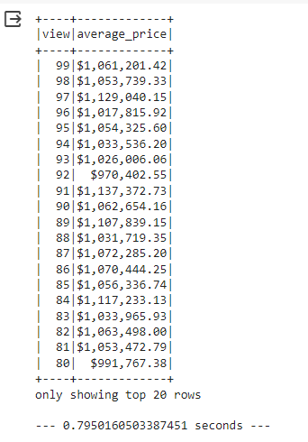
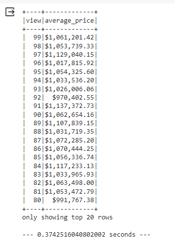
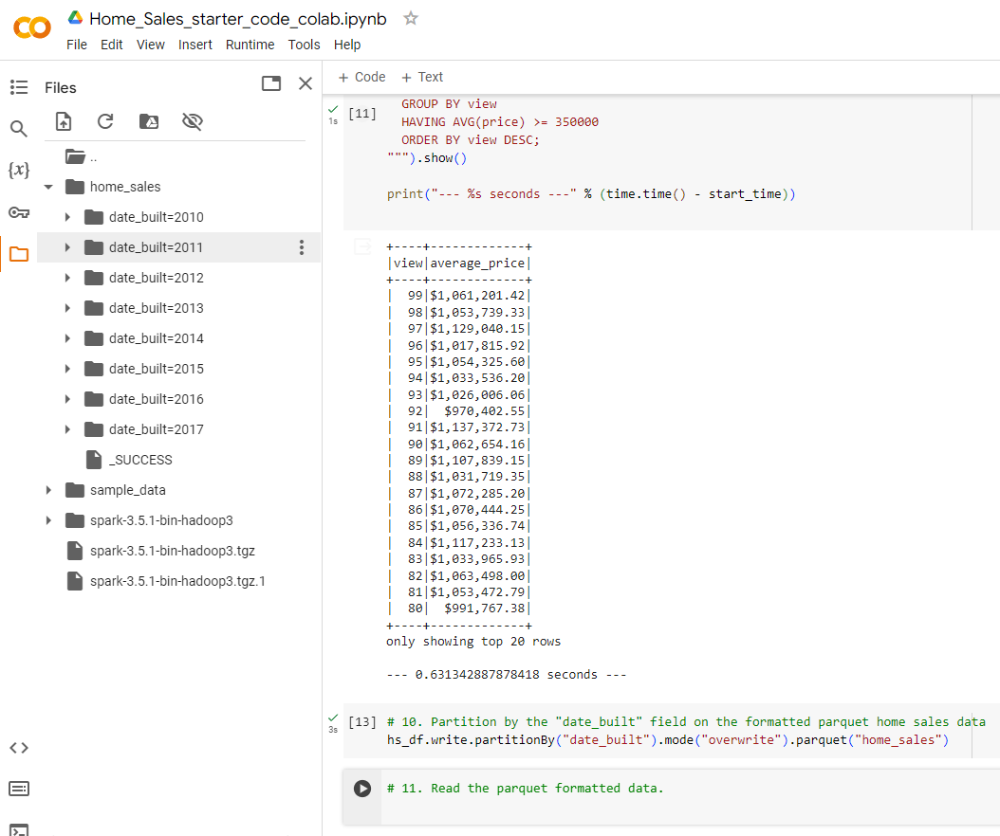
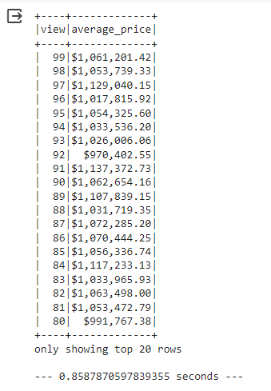

# Home_Sales

Solution for the Challenge of Module 22 ( Big Data ) presented.

## The solution for this Project is presented in the following structure:

1) Home_Sales/README.md (this file).

2) Home_Sales/Home_Sales.ipynb = File containing the python code ran for the Decision Tree Model.

3) Home_Sales/image_results/ = Folder containing snapshots of some of the results for the main functions executed during the analysis.
    * original_table, time to query original table format:
    

    <!-- Add an empty line here -->

    * cached_table, time to query from table in cache:
    

    <!-- Add an empty line here -->

    * parquet_partitions, Output of parquet partition of original DF:
    

    <!-- Add an empty line here -->

    * parquet_table, time to query partitioned table (parquet) format:
    
